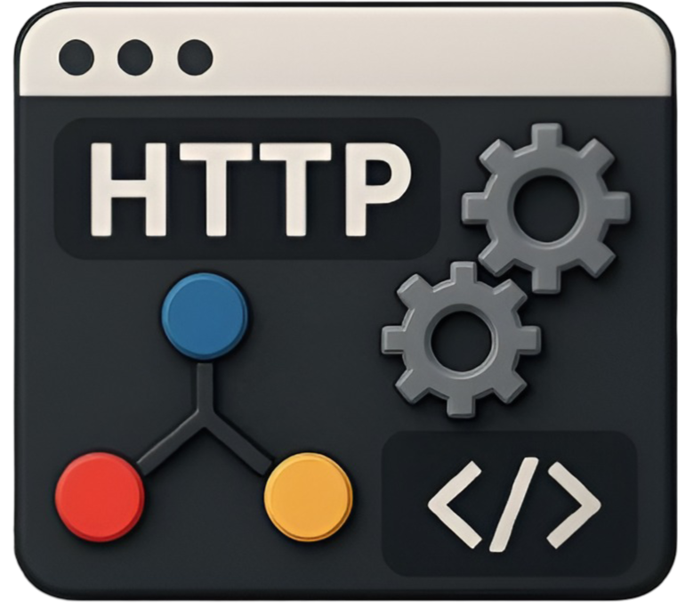

# HttpToolkit Go Pro

<div align="center">
  <picture>
    <source media="(prefers-color-scheme: dark)" srcset="assets/dark_logo.png">
    
  </picture>

  <p><b>Native Go MITM proxy + Wails desktop shell for HTTP/HTTPS/WebSocket/WebRTC interception</b></p>
  <p>Intercept browsers, mobile devices, terminals, JVMs, Docker containers, and APIs — mock traffic, bypass ads/telemetry, and connect AI assistants over MCP.</p>

  <p>
    <a href="https://github.com/Arslan10227/HttpToolkit-Go-Pro/actions"></a>
    
    
    
  </p>
</div>

---

## Overview

**HttpToolkit Go Pro** is a native Go reimplementation of the [HTTP Toolkit](https://httptoolkit.com) Node/Mockttp backend. It provides a lightweight man-in-the-middle (MITM) proxy that intercepts, inspects, and mocks HTTP, HTTPS, WebSocket, and WebRTC traffic — all compiled into a single native binary with no Node.js runtime required.

The desktop app uses [Wails v2](https://wails.io) to wrap the Go server in a WebView2 shell that loads the hosted React UI, giving you a full-featured traffic inspector with native performance.

> **Status:** Under active development. Most interceptors and core proxy features are functional. See [port.md](./port.md) for the full migration checklist.

---

## Features

### Interception

| Interceptor | Description |
|-------------|-------------|
| **Fresh Chrome / Chromium / Edge / Brave / Opera / Arc** | Launch a fresh browser instance pre-configured to use the proxy |
| **Existing Chrome / Chromium / Arc** | Attach to an already-running browser |
| **Fresh Firefox / Firefox Dev / Firefox Nightly** | Launch Firefox with proxy + NSS cert trust |
| **Fresh Safari** | macOS Safari with proxy configuration |
| **System Proxy** | Set OS-level HTTP/HTTPS proxy for all apps |
| **Fresh / Existing Terminal** | Spawn or attach to a terminal with proxy env vars set |
| **Electron** | Launch Electron apps with proxy env vars |
| **Attach JVM** | Java agent injection (attach mode) for JVM HTTP clients |
| **Android ADB** | Wi-Fi proxy + CA cert install via ADB |
| **Android Frida** | Root-based Frida interception with certificate unpinning |
| **iOS Frida** | Frida-based iOS interception |
| **Docker Attach** | Intercept Docker container traffic via network bridge |

### Proxy Engine

- **HTTP/HTTPS MITM** — Full request/response interception with dynamic CA certificate generation
- **HTTP/2** — Native HTTP/2 proxy support
- **WebSocket** — WebSocket proxying and message inspection
- **WebRTC Mocking** — Native Go (Pion) WebRTC mocking — no Node sidecar required
- **SOCKS5** — Optional SOCKS5 proxy mode
- **TLS Passthrough** — Bypass interception for specific domains (telemetry, ads, etc.)
- **Breakpoints** — Pause and modify requests/responses in real-time
- **Request Transformation** — Modify headers, body, status codes on the fly

### Rules & Mocking

- **Mock Rules** — Return custom responses for matched requests
- **Redirect Rules** — Redirect requests to different URLs
- **Delay Rules** — Add artificial latency
- **Passthrough Rules** — Let specific traffic through without interception
- **Transform Rules** — Modify request/response headers and bodies
- **WebSocket Rules** — Mock WebSocket message sequences
- **WebRTC Rules** — Mock WebRTC data channels and messages

### Pro Features

| Feature | Description |
|---------|-------------|
| **Unlimited traffic** | No request capture cap |
| **MCP tools server** | `list_captured_traffic`, `get_traffic_details`, `inject_mock_rule`, `clear_traffic_logs` for AI assistant integration |
| **Google sign-in** | OAuth via system browser + hosted callback |
| **Cloud sync** | Settings, rules, filters synced via Firebase/Upstash Redis |
| **Dynamic Android QR** | LAN IP auto-resolution for mobile pairing |
| **HAR file support** | Import/export HAR files, associate with app |
| **Deep links** | `httptoolkitpro://` protocol for auth callbacks |

---

## Architecture

```
┌─────────────────┐     REST :45457      ┌──────────────────┐
│  Hosted UI      │◄────────────────────►│  Go REST API     │
│  (React/Vercel) │     Admin :45456     │  + interceptors  │
│  or embedded    │◄────────────────────►│                  │
│  WebView2       │     WS /events       │  Go MITM Proxy   │
└─────────────────┘                      └────────┬─────────┘
                                                  │
                                          MITM :8000+ (dynamic)
                                                  │
                                         ┌────────┴────────┐
                                         │ Native MockRTC  │
                                         │ (Pion, in-proc) │
                                         └─────────────────┘
```

| Component | Default Port | Role |
|-----------|-------------|------|
| REST API | **45457** | Interceptors, certs, snippets, MCP, send, shutdown |
| Proxy Admin | **45456** | Session start/stop, rules, WebSocket events |
| MITM Proxy | **8000+** | HTTP/HTTPS/WebSocket interception (dynamic) |
| MockRTC | — | Native Go WebRTC mocking (Pion, in-process) |
| Wails Desktop | — | WebView2 shell embedding Go server + UI |

---

## Quick Start

### Prerequisites

- **Go** 1.26+ (for building from source)
- **WebView2** runtime (Windows, for desktop app)
- **Wails v3** CLI (for desktop builds only): `go install github.com/wailsapp/wails/v3/cmd/wails3@latest`

### Build the Standalone Server

```bash
git clone https://github.com/Arslan10227/HttpToolkit-Go-Pro.git
cd HttpToolkit-Go-Pro

# Create env_defaults.go from template (fill in real values for production)
cp internal/config/env_defaults.go.example internal/config/env_defaults.go

# Build the standalone server
go build -o htk-server ./cmd/htk-server

# Run it
./htk-server
# REST API: http://127.0.0.1:45457
# Admin API: http://127.0.0.1:45456
```

### Build the Wails Desktop App (Windows)

```bash
# Install Wails CLI (if not already installed)
go install github.com/wailsapp/wails/v3/cmd/wails3@latest

# Build the desktop app
wails3 build

# Output: bin/HttpToolkit-Pro.exe
```

### Development Mode

```bash
# Run with hot reload
wails3 dev

# Or run standalone server with verbose logging
./htk-server -v
```

---

## Configuration

### version.yaml

All app identity metadata (name, version, title, author, etc.) is stored in a single file:

```yaml
# internal/config/version.yaml
name: "HttpToolkit Go Pro"
version: "1.0.0-go"
title: "Httptoolkit Go (GoLang Version with Pro by Arslan10227)"
description: "Native Go MITM proxy + Wails desktop shell for HttpToolkit Pro"
author: "Arslan10227"
repository: "https://github.com/Arslan10227/HttpToolkit-Go-Pro"
license: "AGPL-3.0"
```

Edit this file to change the app name, version, or title. The Go code reads it at build time via `//go:embed`.

### Environment Variables

| Variable | Default | Description |
|----------|---------|-------------|
| `HTK_SERVER_PORT` | `45457` | REST API port |
| `HTK_ADMIN_PORT` | `45456` | Proxy admin API port |
| `HTK_SERVER_TOKEN` | (auto-generated) | Bearer auth token for REST API |
| `HTK_ASSETS_DIR` | (auto-detected) | Path to assets directory |
| `HTK_CONFIG_DIR` | (platform-specific) | Config/data directory |
| `HTK_DEV` | `1` | Development mode (relaxed CORS) |
| `GOOGLE_CLIENT_ID` | (from env_defaults.go) | Google OAuth client ID |
| `GOOGLE_CLIENT_SECRET` | (from env_defaults.go) | Google OAuth client secret |
| `UPSTASH_REDIS_URL` | (from env_defaults.go) | Upstash Redis URL for cloud sync |
| `FIREBASE_PROJECT_ID` | `httptoolkitpro` | Firebase project ID |

### env_defaults.go

This file contains default OAuth credentials and is **gitignored**. To set up:

```bash
cp internal/config/env_defaults.go.example internal/config/env_defaults.go
# Edit env_defaults.go and fill in your real credentials
```

In CI, this file is generated automatically from GitHub secrets.

---

## Binaries

| Command | Path | Purpose |
|---------|------|---------|
| `htk-server` | `cmd/htk-server/` | Standalone Go backend (REST + admin + MITM) |
| `htk-mcp` | `cmd/htk-mcp/` | MCP stdio server for AI assistant integration |
| `htk-ctl` | `cmd/htk-ctl/` | Control pipe client for UI operations |
| `HttpToolkit-Pro.exe` | `main.go` + `app.go` | Wails desktop app (WebView2 + embedded server) |

---

## CI / Cloud Builds

The repository includes a GitHub Actions workflow (`.github/workflows/go.yml`) that:

1. **Builds & tests** the standalone server on Ubuntu, Windows, and macOS
2. **Builds the Wails desktop app** on Windows
3. **Uploads binaries** as downloadable artifacts
4. **Injects secrets** at build time to generate `env_defaults.go`

### Required GitHub Secrets

Set these in your repository settings (**Settings → Secrets and variables → Actions**):

| Secret | Description |
|--------|-------------|
| `GOOGLE_CLIENT_ID` | Google OAuth 2.0 client ID |
| `GOOGLE_CLIENT_SECRET` | Google OAuth 2.0 client secret |
| `UPSTASH_REDIS_URL` | Upstash Redis REST URL (`rediss://...`) |
| `FIREBASE_PROJECT_ID` | Firebase project ID (optional, defaults to `httptoolkitpro`) |

If secrets are missing (e.g., PRs from forks), CI uses placeholder values and the build still compiles.

---

## Testing

```bash
# Run all tests
go test ./...

# Run tests with verbose output
go test -v ./...

# Run a specific package's tests
go test -v ./internal/proxy/mitm/...
```

Tests cover:
- MITM proxy HTTP/HTTPS/WebSocket handling
- Rule matching and transformation
- Interceptor activation/deactivation
- Certificate management
- Contract tests (API shape validation)

---

## Project Structure

```
HttpToolkit-Go-Pro/
├── cmd/
│   ├── htk-server/          Standalone Go backend binary
│   ├── htk-mcp/             MCP stdio server
│   └── htk-ctl/             UI operations control client
├── internal/
│   ├── api/                 REST API handlers (port 45457)
│   ├── auth/                Google OAuth integration
│   ├── backup/              Cloud sync (Firebase, Upstash Redis)
│   ├── cert/                CA certificate generation & management
│   ├── config/              Config loading, version.yaml, app metadata
│   ├── docker/              Docker container interception
│   ├── interceptors/        All interceptor implementations
│   ├── logger/              Structured logging
│   ├── mcp/                 MCP (Model Context Protocol) server
│   ├── origins/             Origin allowlist for CORS
│   ├── proxy/
│   │   ├── admin/           Proxy admin API (port 45456)
│   │   └── mitm/            MITM proxy engine (HTTP/HTTPS/WS)
│   ├── rtc/                 Native WebRTC mocking (Pion)
│   ├── server/              Server orchestration
│   ├── session/             Session management
│   ├── settings/            Settings store
│   ├── snippets/            Code snippet generation
│   ├── system/              OS-level operations (registry, file associations)
│   ├── uibridge/            UI operation bridge
│   └── webextension/        Browser extension support
├── assets/                  Embedded assets (logos, NSS, overrides, web UI)
├── contracts/               API contracts and event schemas
├── frontend/                Wails JS bindings
├── build/                   Wails build config
├── .github/workflows/       CI pipeline
├── app.go                   Wails shell app (bound methods)
├── main.go                  Wails entry point
├── go.mod                   Go module definition
├── wails.json               Wails build config
├── version.yaml             ← Single config file for app identity
└── port.md                  Node → Go migration status
```

---

## Comparison

| Area | HTTP Toolkit (upstream) | HttpToolkit Pro (Node) | HttpToolkit Go Pro |
|------|------------------------|------------------------|---------------------|
| Desktop shell | Electron | Wails + Node sidecar | Wails + Go embed |
| Proxy engine | Mockttp (Node) | Mockttp (Node) | Native Go MITM |
| WebRTC mock | MockRTC | MockRTC (Node) | Native Go (Pion) |
| Binary size | ~120 MB | ~85 MB | ~21 MB server / ~67 MB desktop |
| Runtime deps | Node.js | Node.js | None (static binary) |
| Capture limit | Free tier capped | Unlimited | Unlimited |
| MCP support | No | Yes | Yes |

---

## Documentation

| Document | Description |
|----------|-------------|
| [port.md](./port.md) | Detailed Node → Go migration status and checklist |
| [contracts/admin-api.md](./contracts/admin-api.md) | Proxy admin HTTP API reference |
| [contracts/README.md](./contracts/README.md) | Contract test overview |
| [DEVELOPER.md](./DEVELOPER.md) | Developer guide — setup, architecture, contributing |

---

## Contributing

See [DEVELOPER.md](./DEVELOPER.md) for development setup, code architecture, and contribution guidelines.

1. Fork the repository
2. Create a feature branch (`git checkout -b feature/my-feature`)
3. Commit your changes
4. Push to the branch (`git push origin feature/my-feature`)
5. Open a Pull Request

---

## License

This project is licensed under **AGPL-3.0**. See the [license field in version.yaml](./internal/config/version.yaml) for details.

Based on [HTTP Toolkit](https://httptoolkit.com) by Tim Perry.

---

## Author

**Arslan10227**
- GitHub: [Arslan10227](https://github.com/Arslan10227)
- Telegram: [@Arslan10227](https://t.me/Arslan10227)
